# Python 3.7 queries on orientDB via orientDB REST
### Prerequisites
Linux or Mac is recommended, and you need Python 3.6+. If you are using Windows, either setup a VM or use the Linux Subsystem

Python 3.7, orientdb-3.x
- demodb is the database of an hypothetical Travel Agency that runs a public social platform.
- note: pyorient does not support 3.0.6 yet ->“Protocol version 37 is not supported yet by this client”
- orientDB HTTP methods http://orientdb.com/docs/3.0.x/misc/OrientDB-REST.html

### Queries
- Example 1: Find the 'year of birth' of the Profiles, and how many Profiles were born in the same year
- Example 2: Find the top 3 Profiles that have the highest number of Friends
- Example 3: Find Colin's Friends
- Example 4: Find Colin's friends who are also Customers
- Example 5: Find Colin's Friends who are also Customers, and the Countries they are from
- Example 6: Among Colin's Friends, find the top 3 Customers that placed the highest number of Orders
- Example 7: Find all the Friends of Customer identified with OrderedId 1 that are not Customers (so that a product can be proposed)
- Example 8: Find the top 3 Countries from where Customers are from
- Example 10: Find the top 3 Customers in terms of spending
- Example 11: Find all Attractions connected with Customer with OrderedId: 1

### create venv
```
python3 -m venv project_name
source <path_to_project>/bin/activate
which python3
which python
```

### Download orientdb GA Community Edition 3.0.6
- https://orientdb.com/download-previous/
- unzip to desired path, start the server
- when prompted, enter password for root->root123
```
cd <path_to_server>
./bin/server.sh
```
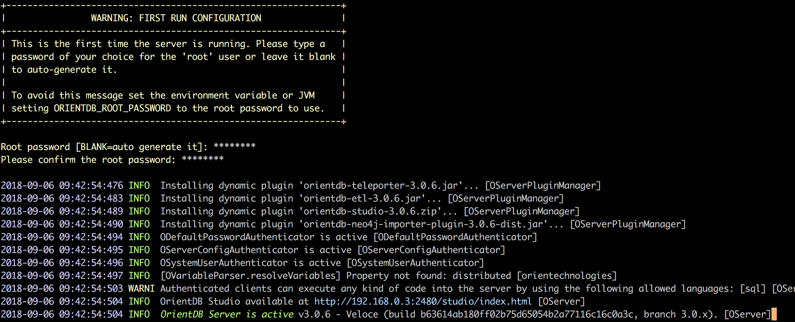

### verify installation
server credentials in $ORIENTDB_HOME/config/orientdb-server-config.xml
```
./bin/console.sh
connect remote:localhost root mypassword
list databases
```
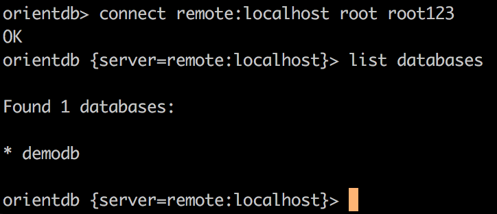

### connecting to  web studio
any of the following wil work
```
http://localhost:2480
http://127.0.0.1:2480/
http://0.0.0.0:2480
```
- Starting with OrientDB v.3.x a new demo database (demodb) is included.
- other public databases can be imported
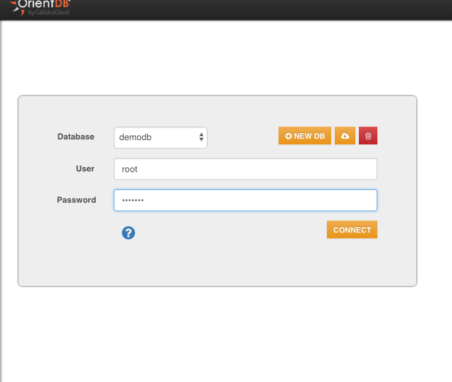
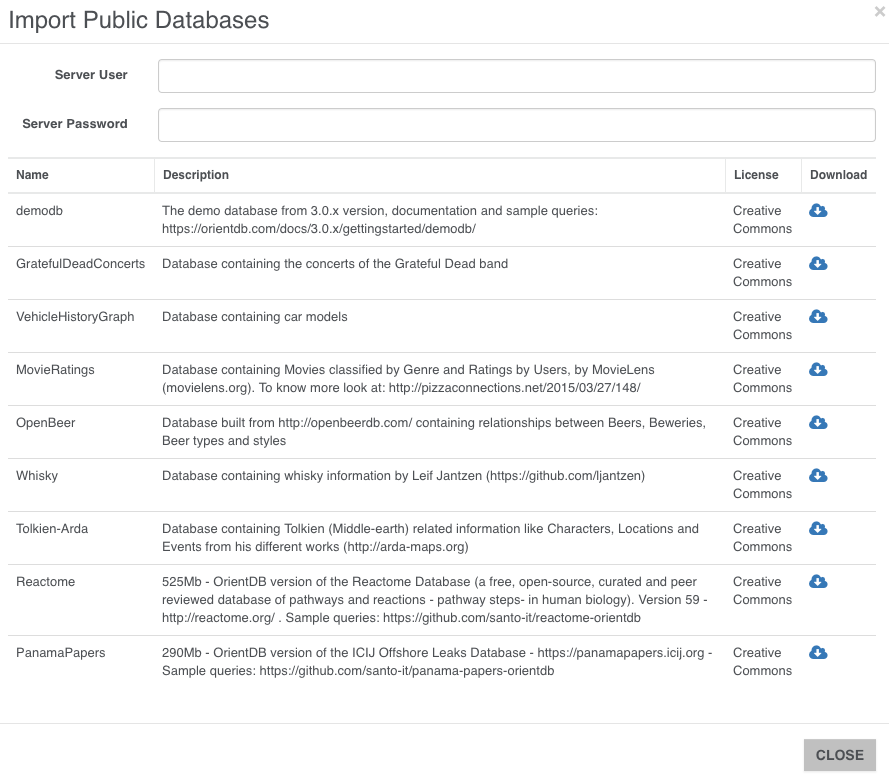

### Data model
- demodb is the database of an hypothetical Travel Agency that runs a public social platform.

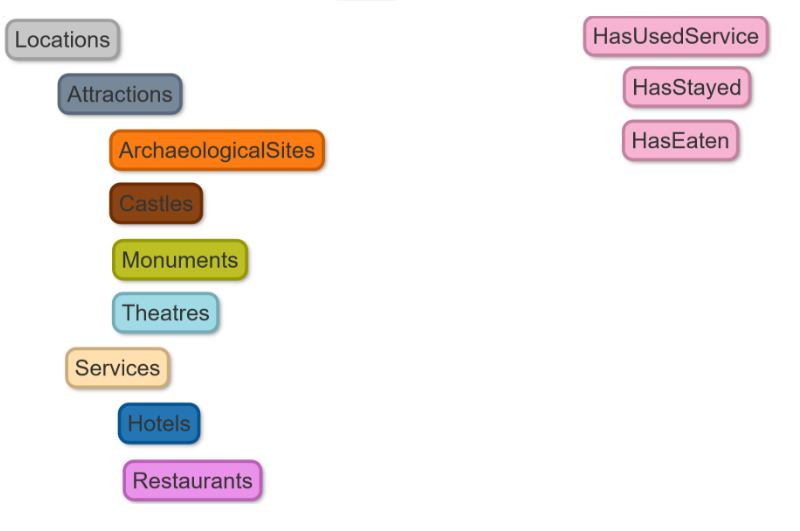

### Queries
- copy or clone the project
- edit settings.py where necessary
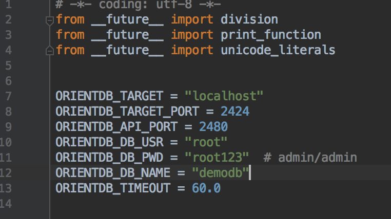


### Example 1: Find the 'year of birth' of the Profiles, and how many Profiles were born in the same year
```
SELECT count(*) as NumberOfProfiles, Birthday.format('yyyy') AS YearOfBirth FROM Profiles GROUP BY YearOfBirth ORDER BY NumberOfProfiles DESC
```
```
python odb_eg_1.py
[
  {
    "NumberOfProfiles": 34,
    "YearOfBirth": "1997"
  },
  {
    "NumberOfProfiles": 29,
    "YearOfBirth": "1953"
  },
  {
    "NumberOfProfiles": 29,
    "YearOfBirth": "1955"
  },
  {
    "NumberOfProfiles": 28,
    "YearOfBirth": "1951"
  },
  {
    "NumberOfProfiles": 26,
    "YearOfBirth": "1959"
  },
  .....

```
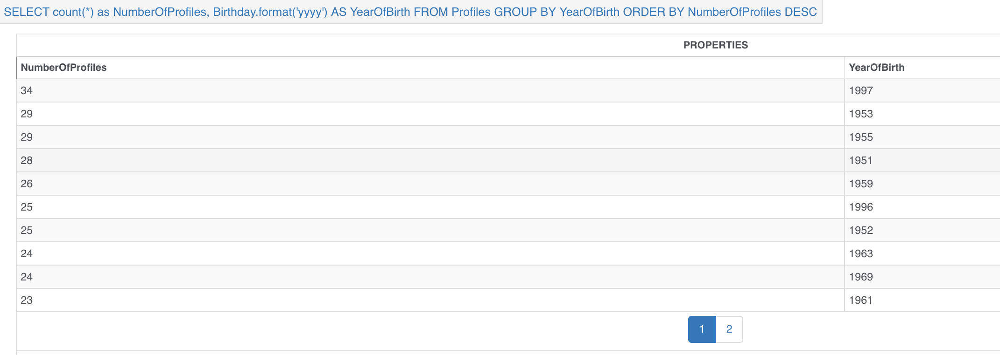

### Example 2: Find the top 3 Profiles that have the highest number of Friends
```
SELECT @rid as Profile_RID, Name, Surname, both('HasFriend').size() AS FriendsNumber FROM `Profiles` ORDER BY FriendsNumber DESC LIMIT 3
```

```
python odb_eg_2.py
[
  {
    "Profile_RID": "#48:116",
    "Name": "Jeremiah",
    "Surname": "Schneider",
    "FriendsNumber": 12
  },
  {
    "Profile_RID": "#45:0",
    "Name": "Frank",
    "Surname": "OrientDB",
    "FriendsNumber": 11
  },
  {
    "Profile_RID": "#46:80",
    "Name": "Tom",
    "Surname": "McGee",
    "FriendsNumber": 11
  }
]
```
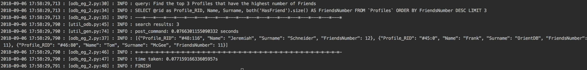

### Example 3: Find Colin's Friends
```
# SELECT EXPAND( BOTH() ) FROM Profiles WHERE Name = 'Colin' AND Surname='OrientDB' ORDER BY FriendsNumber
SELECT @rid as Profile_RID, Name, Surname, both('HasFriend').size() AS FriendsNumber FROM `Profiles` ORDER BY FriendsNumber DESC LIMIT 3
```
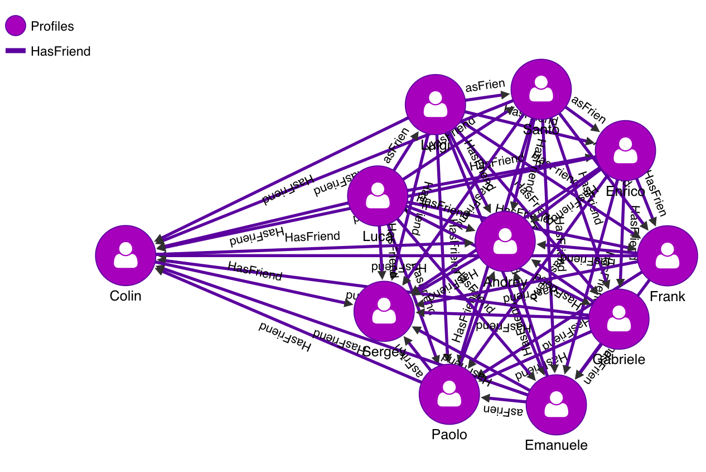
```
python odb_eg_3.py
[
  {
    "@type": "d",
    "@rid": "#43:0",
    "@version": 12,
    "@class": "Profiles",
    "Email": "santo@example.com",
    "in_HasFriend": [
      "#218:0",
      "#219:1"
    ],
    "Bio": "OrientDB Team",
    "Id": 3,
    "Gender": "Male",
    "out_HasFriend": [
      "#220:2",
      "#221:2",
      "#222:2",
      "#223:2",
      "#224:2",
      "#217:3",
      "#218:3",
      "#219:3"
    ],
    "in_HasProfile": [
      "#190:0"
    ],
    "Surname": "OrientDB",
    "Name": "Santo",
    "@fieldTypes": "in_HasFriend=g,Id=l,out_HasFriend=g,in_HasProfile=g"
  },
  ........
]
```

### Example 4: Find Colin's friends who are also Customers
```
MATCH {Class: Profiles, as: profile, where: (Name='Colin' AND Surname='OrientDB')}-HasFriend-{Class: Profiles, as: friend}<-HasProfile-{class: Customers, as: customer}
RETURN $pathelements
```
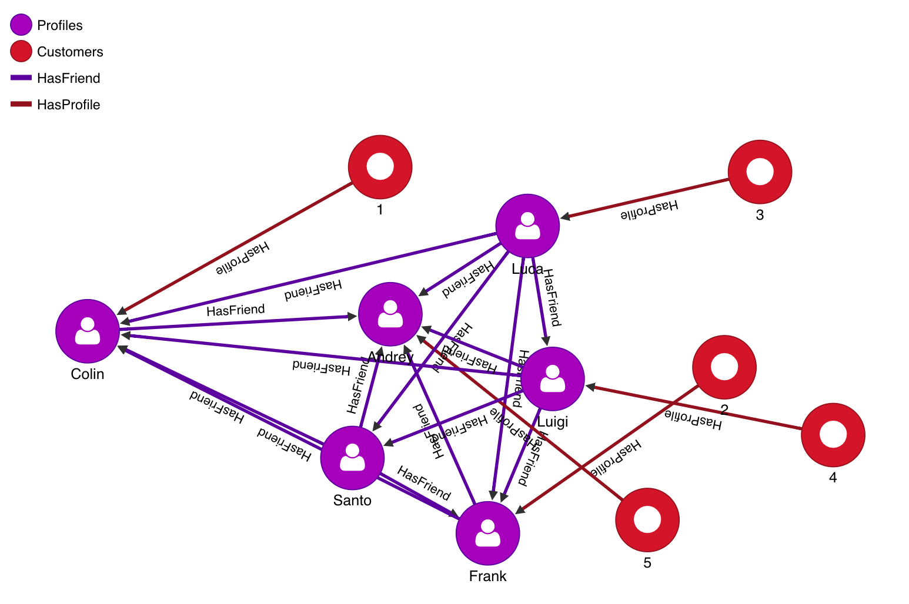
```
python odb_eg_4.py
[
  {
    "Friend_RID": "#41:1",
    "Friend_Name": "Colin",
    "Friend_Surname": "OrientDB",
    "Customer_RID": "#121:0",
    "Customer_OrederedId": 1
  },
  {
    "Friend_RID": "#45:0",
    "Friend_Name": "Frank",
    "Friend_Surname": "OrientDB",
    "Customer_RID": "#122:0",
    "Customer_OrederedId": 2
  },
  .........
```

### Example 5: Find Colin's Friends who are also Customers, and the Countries they are from
```
MATCH {Class: Profiles, as: profile, where: (Name='Santo' AND Surname='OrientDB')}-HasFriend-{Class: Profiles, as: friend}<-HasProfile-{class: Customers, as: customer}-IsFromCountry->{Class: Countries, as: country}
RETURN $pathelements
```
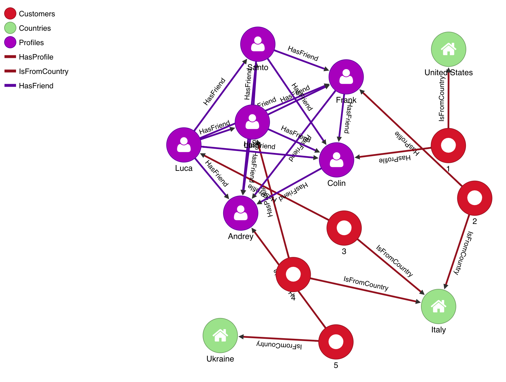
```
python odb_eg_5.py
[{"Friend_RID":"#45:0","Friend_Name":"Frank","Friend_Surname":"OrientDB","Customer_RID":"#122:0","Customer_OrederedId":2,"FriendIsFrom":"Italy"},{"Friend_RID":"#41:0","Friend_Name":"Luca","Friend_Surname":"OrientDB","Customer_RID":"#123:0","Customer_OrederedId":3,"FriendIsFrom":"Italy"},{"Friend_RID":"#42:0","Friend_Name":"Luigi","Friend_Surname":"OrientDB","Customer_RID":"#124:0","Customer_OrederedId":4,"FriendIsFrom":"Italy"},{"Friend_RID":"#43:0","Friend_Name":"Santo","Friend_Surname":"OrientDB","Customer_RID":"#126:0","Customer_OrederedId":6,"FriendIsFrom":"Italy"},{"Friend_RID":"#42:1","Friend_Name":"Andrey","Friend_Surname":"OrientDB","Customer_RID":"#125:0","Customer_OrederedId":5,"FriendIsFrom":"Ukraine"}]
```

### Example 6: Among Colin's Friends, find the top 3 Customers that placed the highest number of Orders
```
SELECT
  OrderedId as Customer_OrderedId,
  in('HasCustomer').size() as NumberOfOrders,
  out('HasProfile').Name as Friend_Name,
  out('HasProfile').Surname as Friend_Surname
FROM (
  SELECT expand(customer)
  FROM (
    MATCH {Class: Profiles, as: profile, where: (Name='Santo' AND Surname='OrientDB')}-HasFriend-{Class: Profiles, as: friend}<-HasProfile-{class: Customers, as: customer}
    RETURN customer
  )
)
ORDER BY NumberOfOrders DESC
LIMIT 3

```

```
python odb_eg_6.py
[
  {
    "Customer_OrderedId": 4,
    "NumberOfOrders": 4,
    "Friend_Name": [
      "Luigi"
    ],
    "Friend_Surname": [
      "OrientDB"
    ]
  },
  {
    "Customer_OrderedId": 2,
    "NumberOfOrders": 3,
    "Friend_Name": [
      "Frank"
    ],
    "Friend_Surname": [
      "OrientDB"
    ]
  },
  {
    "Customer_OrderedId": 1,
    "NumberOfOrders": 1,
    "Friend_Name": [
      "Colin"
    ],
    "Friend_Surname": [
      "OrientDB"
    ]
  }
]
```
### Example 7: Find all the Friends of Customer identified with OrderedId 1 that are not Customers (so that a product can be proposed)
```
SELECT
  @Rid as Friend_RID,
  Name as Friend_Name,
  Surname as Friend_Surname
FROM (
  SELECT expand(customerFriend)
  FROM (
    MATCH {Class:Customers, as: customer, where:(OrderedId=1)}-HasProfile-{Class:Profiles, as: profile}-HasFriend-{Class:Profiles, as: customerFriend} RETURN customerFriend
  )
)
WHERE in('HasProfile').size()=0
ORDER BY Friend_Name ASC

```
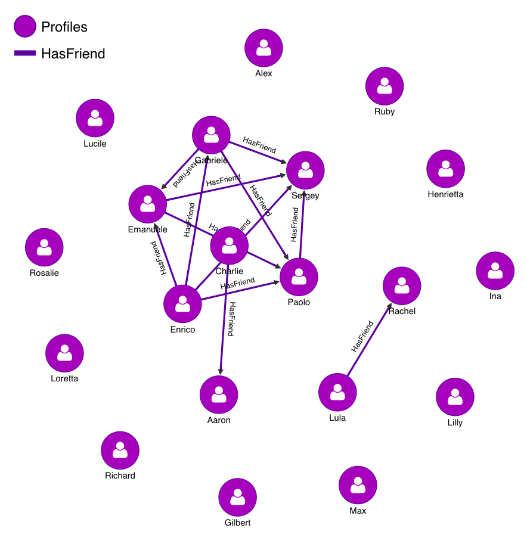
```
python odb_eg_7.py
[{"Friend_RID": "#47:0", "Friend_Name": "Emanuele", "Friend_Surname": "OrientDB"}, {"Friend_RID": "#44:0", "Friend_Name": "Enrico", "Friend_Surname": "OrientDB"}, {"Friend_RID": "#46:0", "Friend_Name": "Gabriele", "Friend_Surname": "OrientDB"}, {"Friend_RID": "#48:0", "Friend_Name": "Paolo", "Friend_Surname": "OrientDB"}, {"Friend_RID": "#43:1", "Friend_Name": "Sergey", "Friend_Surname": "OrientDB"}]
```

### Example 8: Find the top 3 Countries from where Customers are from
```
SELECT
  Name as CountryName,
  in('IsFromCountry').size() as NumberOfCustomers
FROM Countries
ORDER BY NumberOfCustomers DESC
LIMIT 3
```

```
python odb_eg_8.py
[
  {
    "CountryName": "Kyrgyzstan",
    "NumberOfCustomers": 7
  },
  {
    "CountryName": "Madagascar",
    "NumberOfCustomers": 6
  },
  {
    "CountryName": "Burundi",
    "NumberOfCustomers": 6
  }
]
```

### Example 9: Find Colins's Friends who are also Customers, and the Countries they are from
```
MATCH {Class: Profiles, as: profile, where: (Name='Colin' AND Surname='OrientDB')}-HasFriend-{Class: Profiles, as: friend}<-HasProfile-{class: Customers, as: customer}-IsFromCountry->{Class: Countries, as: country}
RETURN $pathelements
```
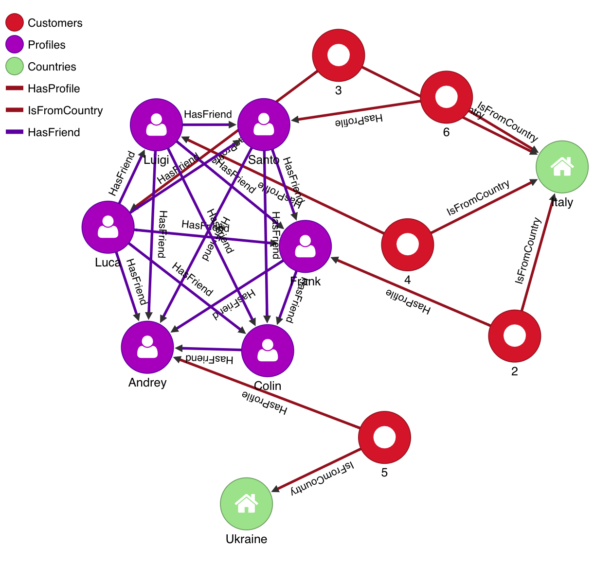
```
python odb_eg_9.py
[{"Friend_RID": "#45:0", "Friend_Name": "Frank", "Friend_Surname": "OrientDB", "Customer_RID": "#122:0", "Customer_OrederedId": 2, "FriendIsFrom": "Italy"}, {"Friend_RID": "#41:0", "Friend_Name": "Luca", "Friend_Surname": "OrientDB", "Customer_RID": "#123:0", "Customer_OrederedId": 3, "FriendIsFrom": "Italy"}, {"Friend_RID": "#42:0", "Friend_Name": "Luigi", "Friend_Surname": "OrientDB", "Customer_RID": "#124:0", "Customer_OrederedId": 4, "FriendIsFrom": "Italy"}, {"Friend_RID": "#43:0", "Friend_Name": "Santo", "Friend_Surname": "OrientDB", "Customer_RID": "#126:0", "Customer_OrederedId": 6, "FriendIsFrom": "Italy"}, {"Friend_RID": "#42:1", "Friend_Name": "Andrey", "Friend_Surname": "OrientDB", "Customer_RID": "#125:0", "Customer_OrederedId": 5, "FriendIsFrom": "Ukraine"}]
```

### Example 10: Find the top 3 Customers in terms of spending
```
SELECT
  customer.OrderedId as customerOrderedId,
  SUM(order.Amount) as totalAmount
FROM (
  MATCH {Class: Customers, as: customer}<-HasCustomer-{class: Orders, as: order}
  RETURN customer, order
)
GROUP BY customerOrderedId
ORDER BY totalAmount DESC
LIMIT 3
```

```
python odb_eg_10.py
[
  {
    "customerOrderedId": 332,
    "totalAmount": 4578
  },
  {
    "customerOrderedId": 322,
    "totalAmount": 4218
  },
  {
    "customerOrderedId": 48,
    "totalAmount": 4166
  }
]
```


### Example 11: Find all Attractions connected with Customer with OrderedId 1:
```
MATCH {class: Customers, as: customer, where: (OrderedId=1)}--{Class: Attractions, as: attraction}
RETURN $pathelements
```

```
python odb_eg_11.py
[{"@type": "d", "@rid": "#121:0", "@version": 12, "@class": "Customers", "out_HasVisited": ["#177:0", "#178:0", "#179:0", "#180:0"], "out_HasStayed": ["#161:0"], "Phone": "+1400844724", "out_HasEaten": ["#169:0", "#170:0", "#171:0"], "OrderedId": 1, "out_HasProfile": ["#185:0"], "out_IsFromCountry": ["#145:0"], "in_HasCustomer": ["#193:0"], "@fieldTypes": "out_HasVisited=g,out_HasStayed=g,out_HasEaten=g,OrderedId=l,out_HasProfile=g,out_IsFromCountry=g,in_HasCustomer=g"}, {"@type": "d", "@rid": "#103:15", "@version": 14, "@class": "Castles", "in_HasVisited": ["#177:0", "#181:35", "#183:204", "#183:228", "#181:243", "#181:271", "#177:334", "#180:403", "#183:518", "#179:574", "#179:580", "#180:596", "#182:619"], "Type": "castle", "Id": 127, "Name": "Ch\u00e2teau de Montmayeur", "@fieldTypes": "in_HasVisited=g,Id=l"}, {"@type": "d", "@rid": "#121:0", "@version": 12, "@class": "Customers", "out_HasVisited": ["#177:0", "#178:0", "#179:0", "#180:0"], "out_HasStayed": ["#161:0"], "Phone": "+1400844724", "out_HasEaten": ["#169:0", "#170:0", "#171:0"], "OrderedId": 1, "out_HasProfile": ["#185:0"], "out_IsFromCountry": ["#145:0"], "in_HasCustomer": ["#193:0"], "@fieldTypes": "out_HasVisited=g,out_HasStayed=g,out_HasEaten=g,OrderedId=l,out_HasProfile=g,out_IsFromCountry=g,in_HasCustomer=g"}, {"@type": "d", "@rid": "#119:5", "@version": 14, "@class": "ArchaeologicalSites", "in_HasVisited": ["#178:0", "#181:9", "#178:16", "#183:61", "#182:77", "#183:121", "#182:271", "#182:274", "#182:304", "#178:330", "#181:373", "#184:387", "#178:590"], "Type": "archaeological_site", "Id": 47, "Name": "Incisioni rupestri", "@fieldTypes": "in_HasVisited=g,Id=l"}, {"@type": "d", "@rid": "#121:0", "@version": 12, "@class": "Customers", "out_HasVisited": ["#177:0", "#178:0", "#179:0", "#180:0"], "out_HasStayed": ["#161:0"], "Phone": "+1400844724", "out_HasEaten": ["#169:0", "#170:0", "#171:0"], "OrderedId": 1, "out_HasProfile": ["#185:0"], "out_IsFromCountry": ["#145:0"], "in_HasCustomer": ["#193:0"], "@fieldTypes": "out_HasVisited=g,out_HasStayed=g,out_HasEaten=g,OrderedId=l,out_HasProfile=g,out_IsFromCountry=g,in_HasCustomer=g"}, {"@type": "d", "@rid": "#94:7", "@version": 11, "@class": "Monuments", "in_HasVisited": ["#179:0", "#178:150", "#182:153", "#179:267", "#179:278", "#182:315", "#183:365", "#183:566", "#182:594", "#180:607"], "Type": "monument", "Id": 62, "Name": "Statua del Savonarola", "@fieldTypes": "in_HasVisited=g,Id=l"}, {"@type": "d", "@rid": "#121:0", "@version": 12, "@class": "Customers", "out_HasVisited": ["#177:0", "#178:0", "#179:0", "#180:0"], "out_HasStayed": ["#161:0"], "Phone": "+1400844724", "out_HasEaten": ["#169:0", "#170:0", "#171:0"], "OrderedId": 1, "out_HasProfile": ["#185:0"], "out_IsFromCountry": ["#145:0"], "in_HasCustomer": ["#193:0"], "@fieldTypes": "out_HasVisited=g,out_HasStayed=g,out_HasEaten=g,OrderedId=l,out_HasProfile=g,out_IsFromCountry=g,in_HasCustomer=g"}, {"@type": "d", "@rid": "#105:8", "@version": 11, "@class": "Theatres", "in_HasVisited": ["#180:0", "#183:52", "#184:80", "#183:221", "#177:259", "#180:335", "#179:396", "#183:434", "#177:445", "#183:466"], "Type": "theatre", "Id": 65, "Name": "Teatro Consorziale", "@fieldTypes": "in_HasVisited=g,Id=l"}]
```
## Author
* **Ishafizan Ishak**


